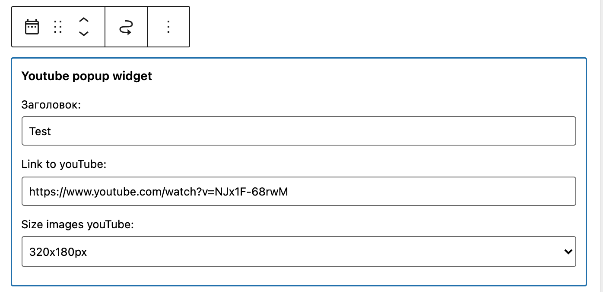

## Widget to create popup youTube

Працює з `Gutenberg`.

## Example of widget completion:

We are looking for a block in widgets `Youtube popup widget`

The widget is used with a plugin [Easy FancyBox](https://ru.wordpress.org/plugins/easy-fancybox/),
or library [fancybox](http://fancybox.net)

You can also extract the second information from the variable `$info_video`